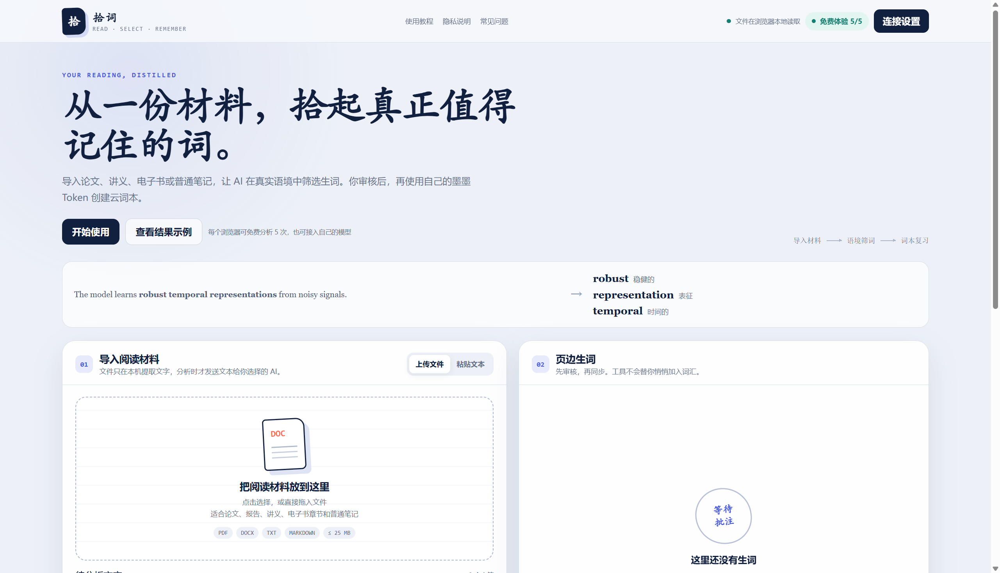

<div align="center">

# 🐴 拾词 · Momo Reading Assistant

### 把读过的英文，变成真正记得住的词

<p>
  <a href="https://momo.zhuofan.me"><strong>🌐 在线体验</strong></a>
  ·
  <a href="https://momo.zhuofan.me/translate/">即时翻译</a>
  ·
  <a href="https://momo.zhuofan.me/music/">音乐歌词</a>
  ·
  <a href="https://momo.zhuofan.me/subtitles/">美剧字幕</a>
  ·
  <a href="https://momo.zhuofan.me/guide/">使用教程</a>
  ·
  <a href="https://momo.zhuofan.me/privacy/">隐私说明</a>
  ·
  <a href="https://momo.zhuofan.me/help/">常见问题</a>
</p>

<p>
  
  
  
  
</p>

</div>

> **拾词不是又一个单词列表。**
> 它从你的论文、讲义、报告和英文笔记中，筛选真正值得记住的词，保留原文语境，经过你审核后，再同步到墨墨云词本。

<div align="center">



<sub>从真实英文材料开始，在语境中理解，在复习中记住。</sub>

</div>

## ✨ 为什么做拾词？

很多单词工具告诉你“这个词是什么意思”，但很少告诉你：

> **为什么这个词值得在这份材料里被记住？**

拾词把英文阅读和词汇复习连成一个闭环：

```text
论文 / 讲义 / 电子书 / 笔记 / 英文图片 / 美剧字幕 / 英文歌曲
              ↓
       本地提取真实语境
              ↓
      AI 筛选值得学习的生词
              ↓
        你审核、编辑和确认
              ↓
          同步到墨墨复习
```

## 🎯 核心功能

| 功能 | 说明 |
| --- | --- |
| 📄 多格式导入 | 支持 PDF、DOCX、TXT、Markdown，也可以直接粘贴英文文本 |
| ↔️ 即时翻译 | 自动区分英文单词与中英文句子；提供词典释义、音标、例句，或自然译文、语气和关键表达 |
| 🖼️ 本地图片 OCR | 支持 PNG、JPG、WEBP、BMP；原图留在浏览器，仅识别后的文字进入筛词流程 |
| 🎬 美剧字幕整理 | 支持 SRT、VTT、ASS、SSA 和粘贴字幕；本地清除中文、样式、重复台词并保留时间码 |
| 🎵 按歌名搜索 | 通过官方歌曲目录确认歌曲、歌手和版本，展示官方试听，不下载或提供整首音乐 |
| 🎙️ 英文歌词识别 | 上传本地 MP3、WAV、M4A、OGG 或 FLAC，在浏览器生成轻量分片后用自有 OpenAI / Groq 语音模型转写 |
| 🧠 语境筛词 | 根据四级、六级、考研、雅思、托福、专业论文、美剧日常口语和英文歌曲等目标筛选生词 |
| 🌱 适配真实水平 | 新增 A1、A2、B1 基础档位，也可用一句话自定义自己的词汇水平和目标 |
| ＋ 词汇扩展 | 可选择仅看核心生词、附带常用短语，或同时查看派生词与短语 |
| ✍️ 人工审核 | AI 只负责建议，你决定哪些词真正进入词本 |
| 📌 保留语境 | 每个单词都保留原文例句、中文释义和筛选理由 |
| ☁️ 墨墨同步 | 使用你自己的墨墨 Access Token 创建云词本 |
| 🔌 自选 AI 来源 | 支持 15 家官方兼容服务商，粘贴 API Key 后自动识别文本模型并下拉选择 |
| ↗ 官方密钥入口 | 选择服务商后显示对应的官方 API Key 控制台链接，并在新标签页打开 |
| 💾 持久连接 | 默认在当前浏览器保存 API Key、墨墨 Token 和所选模型，也可切换为仅当前标签页保存 |
| 🎟️ 限时免费 | 每个浏览器从首次成功分析起，连续 7 天不限分析次数 |
| ◌ 操作状态 | 提供解析中、分析中、失败、完成及同步反馈 |
| ? Token 帮助 | 只分析不需要墨墨 Token，创建云词本时才需要 |
| 🔒 Local-first | 文档解析与图片英文 OCR 均在浏览器本地完成 |
| 📱 响应式界面 | 桌面端和移动端均可使用，适合学习、阅读和快速复习 |

## 🔌 支持的 AI 服务商

连接设置页目前提供 15 家服务商，并按国内、国际分组展示：

| 国内服务 | 国际服务 |
| --- | --- |
| DeepSeek | OpenAI |
| 火山方舟 Doubao | Google Gemini |
| Kimi 开放平台 | OpenRouter |
| 千问开放平台 Qwen | Groq |
| MiniMax 开放平台 | Together AI |
| 小米 MiMo | Mistral AI |
| 智谱 GLM | xAI |
| 硅基流动 SiliconFlow | — |

模型选择流程：

1. 选择服务商并粘贴自己的 API Key；
2. 页面自动读取该 Key 当前可用的文本模型；
3. 在可搜索的模型下拉栏中选择模型，再发送最小测试请求；
4. 如果服务商没有开放模型列表、账号权限不足或目标模型未被返回，页面会自动切换到手填模式。

> 火山方舟的推理 API 不直接返回账号模型目录，因此页面会先展示官方候选模型。你也可以手动填写控制台中的模型 ID 或推理接入点 ID，并通过“测试 AI 连接”确认是否可用。

## 🧪 一个简单例子

输入一段真实的技术英文：

```text
The model learns robust temporal representations from noisy signals.
```

拾词不会机械地返回整篇文章，而是结合阅读目标筛选：

| Word | Meaning | Why it matters |
| --- | --- | --- |
| **robust** | 稳健的 | 科研论文中高频出现，用于描述模型或方法的抗干扰能力 |
| **representation** | 表征 | 深度学习和机器学习论文中的核心术语 |
| **temporal** | 时间的 | EEG、信号处理和时序建模场景中的重要词汇 |

每个候选词还可以按需展开词族和常用搭配，例如 `robustness`、`robust to noise`。这些扩展只用于辅助理解，不会自动写入墨墨词本。

## 🔐 隐私设计

拾词处理英文材料时遵循“先本地、后分析”的原则：

- 文件文字、图片英文内容与字幕都在浏览器本地提取或清洗，原文件、原图和字幕文件不上传；音乐原文件也在浏览器解码，不作为完整文件上传；
- 歌名搜索词会发送给 Apple 公开歌曲目录；开始音乐识别后，浏览器生成的 30 秒以内 WAV 分片才会发送给用户选择的 OpenAI 或 Groq；
- 只有你确认分析或点击翻译的文本才会发送给所选 AI 服务商；
- 访问者可选择将 AI API Key、墨墨 Token 和所选模型保存在当前浏览器的 `localStorage`，重新打开网站后自动恢复；
- 在公共设备上可以关闭“记住连接”，此时凭据仅保存在当前标签页的 `sessionStorage`；
- “清除”按钮会同时删除该项在 `localStorage` 与 `sessionStorage` 中的数据；
- 网站不会替你悄悄把词加入墨墨词本，必须经过人工审核；
- 不要把 `.env.local`、API Key 或 Access Token 提交到仓库。

> 请注意：图片 OCR 已支持；扫描版 PDF 暂未自动逐页 OCR，可将需要的页面导出为图片上传。超长材料会截取前 150,000 个字符用于分析。

## 🚀 快速开始

### 在线使用

打开 [momo.zhuofan.me](https://momo.zhuofan.me)，可以先查看结果示例，再导入自己的阅读材料。

### 本地开发

```bash
npm install
npm run build
npm test
```

如果要进行本地浏览器检查：

```bash
vercel dev
node .\tests\browser-check.mjs
```

安全依赖检查：

```bash
npm audit --omit=dev
```

## 🧱 技术栈

- **Frontend**：原生 HTML / CSS / JavaScript
- **Backend**：Vercel Serverless Functions
- **Document parsing**：`pdfjs-dist`、`mammoth`
- **Image OCR**：`Tesseract.js`（英文识别引擎与语言数据本地托管）
- **Subtitle parsing**：原生 JavaScript 本地解析 SRT、VTT、ASS、SSA，清洗双语字幕并保留时间轴
- **Music catalog**：Apple iTunes Search API，仅用于歌曲元数据、封面和官方试听
- **Audio processing**：Web Audio API 本地解码、单声道混音、16 kHz 重采样与 WAV 分片
- **Speech-to-text**：用户自有 OpenAI / Groq API，服务端固定地址白名单
- **AI integration**：OpenAI-compatible API
- **Model discovery**：服务端官方地址白名单、动态模型目录、文本模型过滤与手填兜底
- **Deployment**：Vercel
- **Design direction**：Local-first、privacy-aware、context-aware learning

## 🗂️ 项目结构

```text
momo-reading-assistant/
├── api/
│   ├── analyze.mjs       # AI 语境筛词接口
│   ├── translate.mjs     # 单词查询与句子翻译接口
│   ├── music-search.mjs  # 官方歌曲目录搜索代理
│   ├── transcribe.mjs    # 音频分片转写代理
│   ├── models.mjs        # 使用访客 Key 识别可用文本模型
│   ├── quota.mjs         # 免费体验额度接口
│   └── sync.mjs          # 墨墨云词本同步接口
├── public/
│   ├── index.html        # 拾词工作台
│   ├── app.js            # 前端交互逻辑
│   ├── translate.js      # 翻译模式、结果卡片与复制交互
│   ├── translate/        # 即时翻译独立页面
│   ├── audio-utils.js    # 本地音频混音、重采样与 WAV 分片
│   ├── music.js          # 歌曲搜索、音频识别与工作台交接
│   ├── music/            # 音乐歌词独立页面
│   ├── subtitle-parser.js # 本地字幕解析与双语清洗
│   ├── subtitles.js      # 字幕时间轴与工作台交接
│   ├── subtitles/        # 美剧字幕独立页面
│   ├── connections.js    # AI 与墨墨连接设置
│   └── site.css          # 页面样式
├── tests/                # 单元测试与浏览器检查
├── docs/
│   └── preview.png       # 项目截图
├── build.mjs
├── vercel.json
└── package.json
```

## ⚙️ 生产环境变量

| 变量 | 用途 |
| --- | --- |
| `DEEPSEEK_API_KEY` | 免费体验使用的服务端 AI 密钥 |
| `DEEPSEEK_BASE_URL` | 免费体验模型的 API 地址 |
| `DEEPSEEK_MODEL` | 免费体验使用的模型名称 |
| `SESSION_SECRET` | 至少 32 字符，用于签署免费体验开始时间 Cookie |

访问者自己的 API Key 和墨墨 Token **不应配置为生产环境变量**。

## 🧭 产品原则

```text
AI 提供建议，但不替你做决定。
材料先留在本地，发送前明确告知。
单词不脱离语境，复习不脱离目标。
```

## 📌 项目状态

当前版本已经上线，支持从英文材料、图片、美剧字幕与用户持有的英文歌曲中整理语境，经过 AI 筛词和人工审核后同步到墨墨云词本。后续可以继续完善：

- 扫描 PDF 的逐页 OCR 支持；
- 视频文件与实时语音识别；
- 更丰富的词汇难度和领域标签；
- 生词结果导出与复习统计；
- 更细粒度的隐私和数据管理控制；
- 更完整的演示数据和自动化测试。

## ⚠️ 免责声明

本项目是个人开发的**非官方学习工具**，与墨墨背单词官方没有隶属、合作或背书关系。请妥善保管自己的 API Key、Access Token 和阅读材料。

## 💬 一句话介绍

> **拾词：从真实英文阅读里，筛出值得记住的词。**

<div align="center">

Made with 📚 · 🧠 · 🐴

</div>
